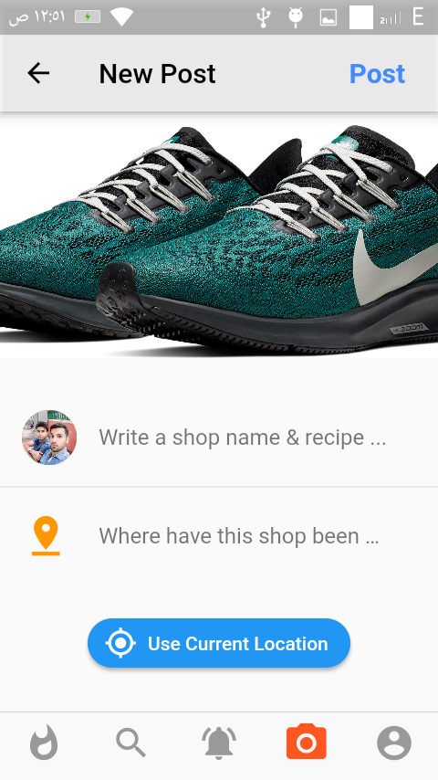
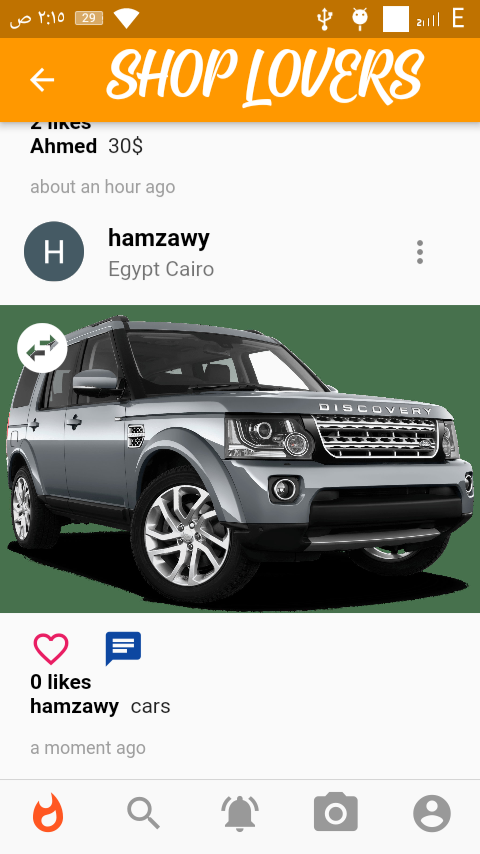
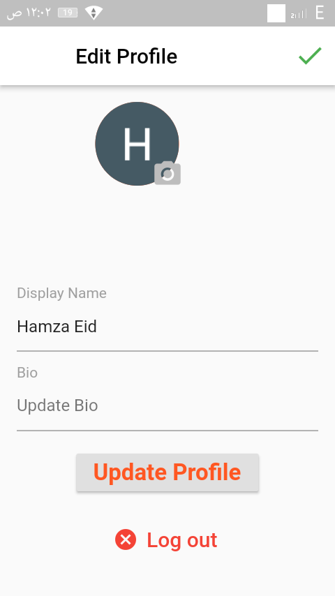

# shop_lovers_app

It's a social flutter application that offer the user to share shop photos & recipes with his followers by useing firebase .

## some vidoes
<!-- record_1 -->

<!-- record_2 -->

<!-- record_2 -->

## Screenshots

   

       

    

    

    

    

    

    

    
